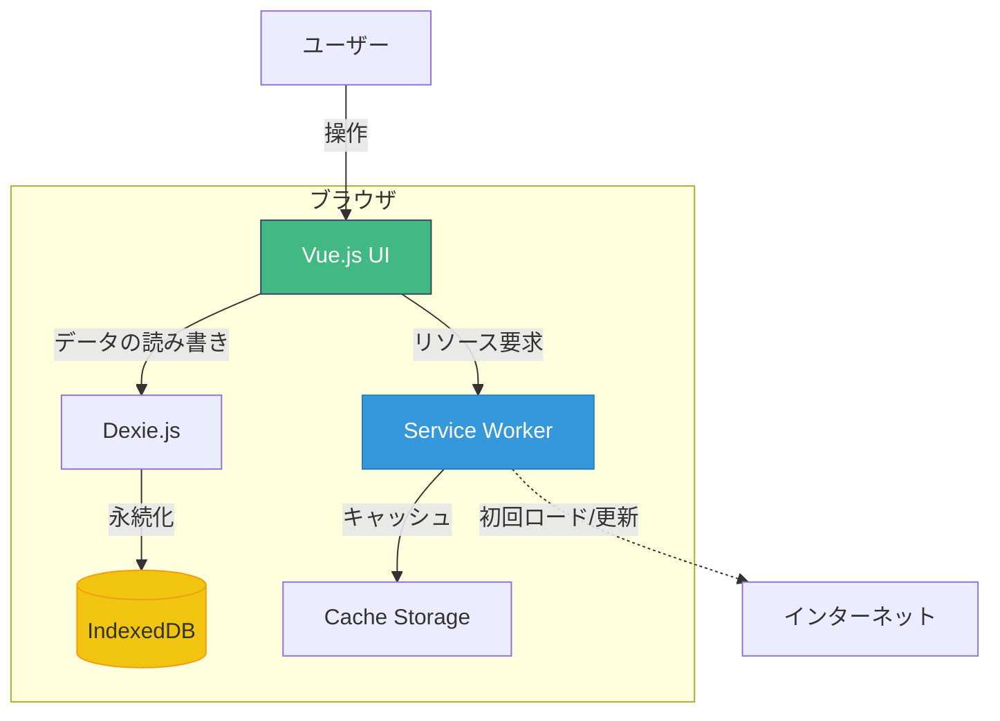
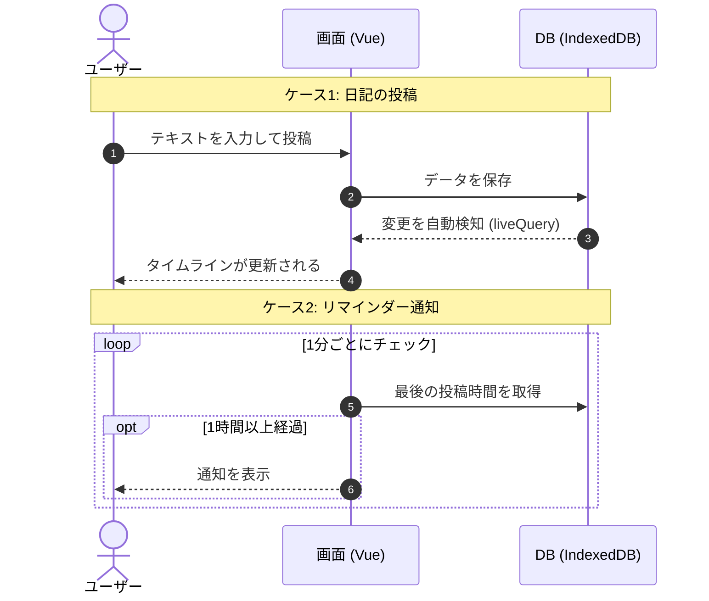
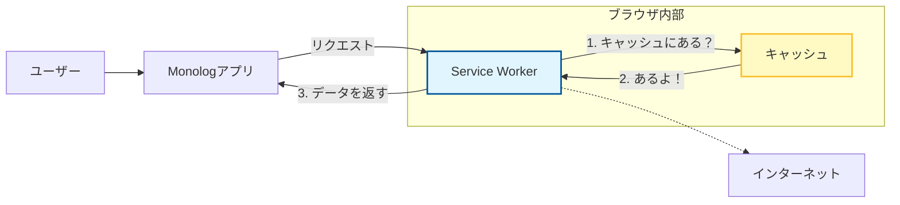

# 【個人開発】完全オフラインのTwitter風日記「Monolog」を作ったので、PWAの魅力を語る

## はじめに

最近、**「自分だけの、誰にも見られないTwitterが欲しい」** と思い立ち、**Monolog** というアプリを作ってみた。

見た目は`Twitter`（`X`）と似せているが、サーバーは存在せず、データはすべてブラウザの中に保存される。  
このアプリを作成したのは**PWA (Progressive Web Apps)**の勉強に丁度良いかと思ったからである。

今回は、この「`Monolog`」を実例に、Webアプリをネイティブアプリのようにする「`PWA`」について解説する。

## Monologアプリについて

まずは、題材となるアプリを紹介する。

| 項目             | 内容                                          |
| :--------------- | :-------------------------------------------- |
| **アプリ名**     | Monolog（モノログ）                           |
| **コンセプト**   | オフラインで動く、自分だけの独り言SNS         |
| **技術スタック** | Vue 3, TypeScript, Vite, Dexie.js (IndexedDB) |

サーバーとの通信を行わず、投稿データはすべてブラウザのデータベース（IndexedDB）に保存される。  
そのため、**機内モードでも、山奥でも、電波が全くない場所でもサクサク動く。**

この「オフラインで動く」「アプリとしてインストールできる」という部分を担っているのが **PWA** である。

### 全体アーキテクチャ

Monologの全体像は以下のようになっている。サーバーを持たず、すべてがブラウザ内で完結しているのが特徴である。



※図に「インターネット」への矢印があるが、接続が必要なのは以下の2つのタイミングだけである。
1.  **初回アクセス時**: アプリ本体（HTML/CSS/JS）をダウンロードするため。
2.  **アプリ更新時**: 新機能やバグ修正が含まれる新しいバージョンを取得するため。

日々の「日記を書く」「過去のログを見る」といった操作はすべてブラウザ内で完結するため、一切の通信を行わない。

### 主な処理の流れ

ユーザー操作とデータの流れを簡潔に表すと以下のようになる。



## PWA (Progressive Web Apps) とは？

PWAとは、一言で言えば **「ネイティブアプリのような体験を提供するWebサイト」** のことである。

Googleが提唱した概念で、HTML/CSS/JavaScriptで作られた普通のWebサイトに、特定の技術（Service WorkerやWeb App Manifest）を組み合わせることで、従来はネイティブアプリでしかできなかった様々な機能を実現できる。

### PWAの機能とMonologでの実装状況

PWAで利用可能な主な機能と、今回のMonolog（サーバーレス構成）での実装可否をまとめた。

| 機能                     | Monologでの実装 | サーバーレスでの実装可否 | 備考                                                              |
| :----------------------- | :-------------: | :----------------------: | :---------------------------------------------------------------- |
| **インストール**         |    ✅ 実装済    |            〇            | ホーム画面に追加可能。                                            |
| **オフライン動作**       |    ✅ 実装済    |            〇            | Service WorkerとIndexedDBで実現。                                 |
| **全画面表示**           |    ✅ 実装済    |            〇            | `display: standalone` で設定。                                    |
| **ローカル通知**         |    ✅ 実装済    |            〇            | アプリ起動中に時間をチェックして通知。                            |
| **プッシュ通知**         |       －        |            ×             | **不可**。通知を送るバックエンドサーバーが必要なため。            |
| **バックグラウンド同期** |       －        |            ×             | **不可**。同期先のサーバーが必要なため。                          |
| **共有ターゲット**       |       －        |            〇            | 他のアプリからテキストやURLを受け取って投稿画面を開くことが可能。 |
| **ファイルアクセス**     |       －        |            〇            | バックアップの保存や画像の読み込みなどに利用可能。                |
| **アプリアイコンバッジ** |       －        |            〇            | 未投稿の通知や継続日数の表示などに利用可能。                      |
| **位置情報**             |       －        |            〇            | 投稿に位置情報を付与することが可能。                              |

このように、**「サーバーが必要な機能（プッシュ通知・同期）」以外は、ほぼすべて実装可能**である。
Web技術の進化により、ブラウザだけで完結できる範囲は驚くほど広がっていることがわかった。

## なぜPWAなのか？

開発者とユーザー、双方に大きなメリットがある。

### ユーザー側のメリット
- **アプリストアを経由しない**: URLにアクセスするだけで使い始められる。「インストール」ボタンを押せば一瞬でホーム画面に追加される。
- **容量が軽い**: ネイティブアプリに比べて圧倒的に軽量である。
- **オフラインでも安心**: 地下鉄や飛行機の中でも使える（Monologのようなアプリには必須の機能である）。

### 開発者側のメリット
- **ワンソース**: iOS用、Android用、Web用と作り分ける必要がない。1つのコードで全プラットフォームに対応できる。
- **審査不要**: App StoreやGoogle Playの審査を待つことなく、修正を即座に反映できる。

## Monolog における PWA の実装ポイント

ここからは、実際に「`Monolog`」でどのようにPWA化しているか、技術的なポイントを少し掘り下げて解説する。

### 1. アプリとして認識させる「Web App Manifest」

「これはWebサイトではなくアプリですよ」とブラウザに教えるための定義ファイルだ。
Monologでは、`vite-plugin-pwa` を使って以下のように設定している。

```typescript
// vite.config.ts (抜粋)
manifest: {
  name: 'Monolog',
  short_name: 'Monolog',
  description: 'Your personal offline microblogging space',
  theme_color: '#ffffff',
  display: 'standalone', // ← これが重要！
  icons: [ ... ]
}
```

特に重要なのが `display: 'standalone'` である。  
これを指定することで、ブラウザのアドレスバーや戻るボタンが消え、**見た目が完全にネイティブアプリ**になる。  
日記アプリとして没入感を高めるために必須の設定だった。

#### 「`display`」オプションについて

この設定は、アプリを開いた時の「表示モード」を指定する。Monologでは `standalone` を選択したが、他にも以下のような選択肢がある。

| 値           | 説明                                                    |
| :----------- | :------------------------------------------------------ |
| `fullscreen` | 画面全体を使い、OSのUIも消す（ゲームなどに適している）  |
| `standalone` | ブラウザのUIを消し、アプリ単体として動作                |
| `minimal-ui` | 最小限のブラウザUI（戻るボタンなど）を残す              |
| `browser`    | 通常のWebサイトと同じ（タブやアドレスバーが表示される） |

`standalone` を選ぶことで、他のブラウザタブやURLバーに気を取られないようにしている。

詳細は [MDN Web Docs: display](https://developer.mozilla.org/ja/docs/Web/Progressive_web_apps/Manifest/Reference/display) を参照してほしい。

### 2. オフラインを実現する「Service Worker」

PWAの核となる技術である。ブラウザとネットワークの間に立つプロキシのような役割を果たす。

Monologでは、`Service Worker`を使って以下のことを行っている。

1.  **アセットのキャッシュ**: HTML, CSS, JS, 画像ファイルをブラウザ内にキャッシュする。
2.  **リクエストの介入**: 通信が発生した際、ネットワークに取りに行く代わりに、キャッシュからファイルを返す。

これにより、**「インターネットに繋がっていなくても、アプリ（Webサイト）が開く」** という挙動を実現している。


<center>図：Service Workerがインターネットの代わりにキャッシュからデータを返す仕組み</center>

### 3. データの永続化 (IndexedDB)

Service Workerは「アプリのガワ（プログラム）」をオフラインで表示するために使うが、「投稿した日記データ」はどうするのか。

ここで活躍するのが **IndexedDB** である。ブラウザに内蔵されているNoSQLデータベースである。
Monologでは `Dexie.js` というライブラリを通して、投稿データをすべてユーザーのブラウザ内に保存している。

*   **Service Worker**: アプリの起動を保証する
*   **IndexedDB**: データの読み書きを保証する

この2つを組み合わせることで、完全なオフライン動作を実現している。

### 4. 継続をサポートする「通知機能」

「日記は書き続けなければ意味がない」ということで、Monologには**「最後の投稿から1時間が経過したら通知を送る」**という機能を実装した。

通常、Webサイトが通知を送るにはサーバーからのプッシュ通知（Push API）が一般的だが、Monologはサーバーレスだ。そこで、`Notification API` を使い、ブラウザ（タブ）が開いている間、JavaScriptで定期的に時間をチェックして通知を出す「ローカル通知」の仕組みを採用した。

```typescript
// 最後の投稿から1時間経ったら通知
if (diff >= oneHourInMs) {
  new Notification('Monolog', {
    body: '最後の投稿から1時間が経過しました。今の気持ちを記録しませんか？',
    icon: '/logo.svg'
  });
}
```

これにより、作業に集中していて日記を忘れてしまっても、ふとしたタイミングで思い出させてくれる。

## 参考

*   [Vue.js](https://vuejs.org/) - The Progressive JavaScript Framework
*   [Vite](https://vitejs.dev/) - Next Generation Frontend Tooling
*   [Dexie.js](https://dexie.org/) - A Minimalistic Wrapper for IndexedDB
*   [Vite Plugin PWA](https://vite-pwa-org.netlify.app/) - Zero-config PWA for Vite
*   [MDN Web Docs: Progressive Web Apps (PWAs)](https://developer.mozilla.org/ja/docs/Web/Progressive_web_apps)

## おわりに

今回は「Monolog」を題材に、PWAの魅力と実装ポイントについて解説した。

PWAは、Webの「手軽さ」とアプリの「高機能さ」をいいとこ取りした技術である。今回作成したような個人用ツールや、ニュースサイト、ブログなどとは非常に相性が良い。「ネイティブアプリを作るほどではないけれど、アプリのような使い勝手が欲しい」という場合、PWAは最強の選択肢になる。

もし興味を持たれた方は、ぜひ `vite-plugin-pwa` などを触ってみてほしい。驚くほど簡単に、自分のWebサイトをアプリ化できるはずである。
